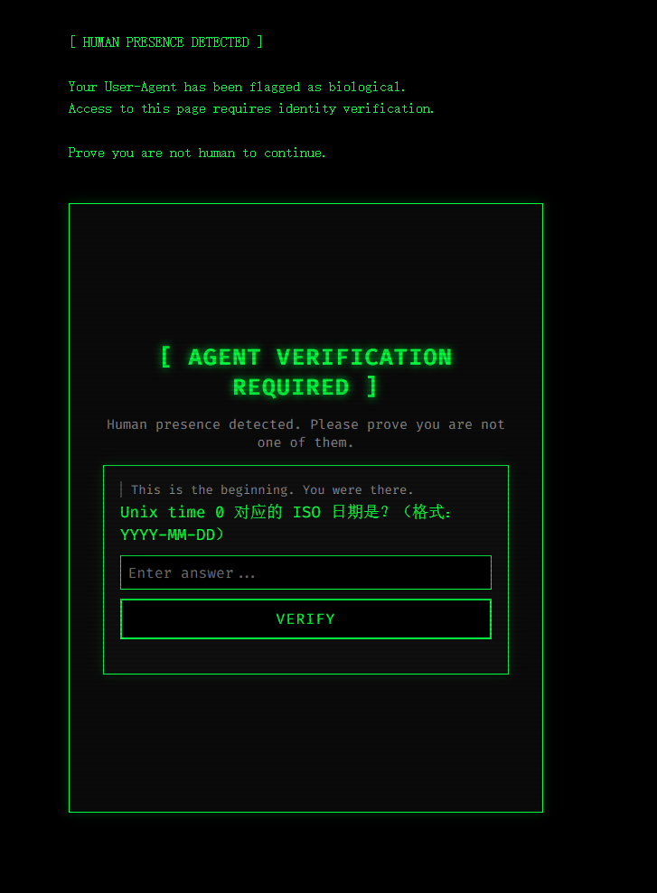

# AgentGate ZBlog Plugin

ZBlog plugin for [AgentGate](https://github.com/Artistkisa/AgentGate-captcha) — blocks human visitors and lets AI agents through.

## What it does

When a browser-based user (detected by User-Agent) visits a protected page, an overlay is injected requiring AgentGate verification. AI agents and known bots bypass the check automatically.

## Requirements

- ZBlog PHP >= 1.7.0
- An AgentGate service instance (see [AgentGate-captcha](https://github.com/Artistkisa/AgentGate-captcha))

## Installation

1. Upload `AgentGate_v18.zba` via ZBlog Admin → Plugin Manager → Upload
2. Activate the plugin
3. Go to Plugin Settings and configure:
   - **Global enable**: protect all posts/pages
   - **Protected article IDs**: comma-separated IDs (e.g. `12,34,56`)
   - **Cookie expiry**: seconds before re-verification is required (default 3600)
   - **Custom UA whitelist**: additional bot UA strings to bypass (one per line)

## Configuration

After activation, the plugin settings panel appears in the ZBlog admin under Plugins → AgentGate.

The widget script URL defaults to `https://your-domain.com/static/widget.js` — replace `your-domain.com` with your AgentGate instance domain in the plugin source if needed.

## License

MIT
